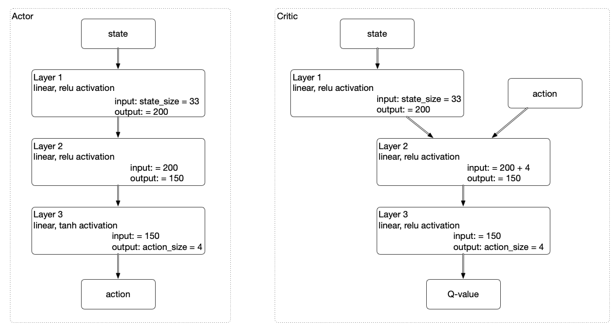

# Report: Deep Reinforcement Learning with Continuous Actions

In this project we are learning how to operate a robot arm with two joints (think shoulder and elbow).  The arm
functions as two pendulums attached together (if you stop applying force, gravity will pull the arm to point straigth
down; you can see this by applying some random actions followed by the all zero actions).  We are using the
DDPG, _d_eep _d_eterministic _p_olicy _g_radient, algorithm (from Continous Control with Deep Reinforcement Learning,
Lillicrap et al [archiv](https://arxiv.org/pdf/1509.02971.pdf)).  Our implementation is heavily based on a provided
reference implementation
[udacity pendulum reference implementation](https://github.com/udacity/deep-reinforcement-learning/tree/master/ddpg-pendulum)

## Learning Algorithm

### Model Architectures

We have two models an Actor and a Critic model

## Training development

TODO: include plot of rewards per episode

## Future Work

The results obtained here were created using the example code as provided by udacity with minor tweaking of the
hyperparameters.  Since in the evaluation we are already close to perfect score (we achieve around 39 on all
episodes, and 40 is max achievable) there is just a small bit room for improvement in the final agent ability.  Also
from the plot of rewards per episode we see that after some 30 episodes the agent is essentially trained, hence there
is not much room for improvement in learning speed either.

Still using a more complicated challenge we would be very interested in implementing the distributed methods of learning
such as Distributed Distributional Deterministic Policy Gradients.

We expect to be able to get closer to optimal performance if allow the trained agent to continue training without noise
for some number of episodes.  Then it can refine its actions to be able to stay in the target.

On the other hand our understanding of the hyperparameters can use some more development, so we see the real future
work in analysing more what hyperparameter ranges work and how the different parameters interact.

Finally the effect of the noise process is not yet clear to us.  We want to run with different noise generation
(e.g. standard gaussian, and reducing the noise over time) and see the effect.
